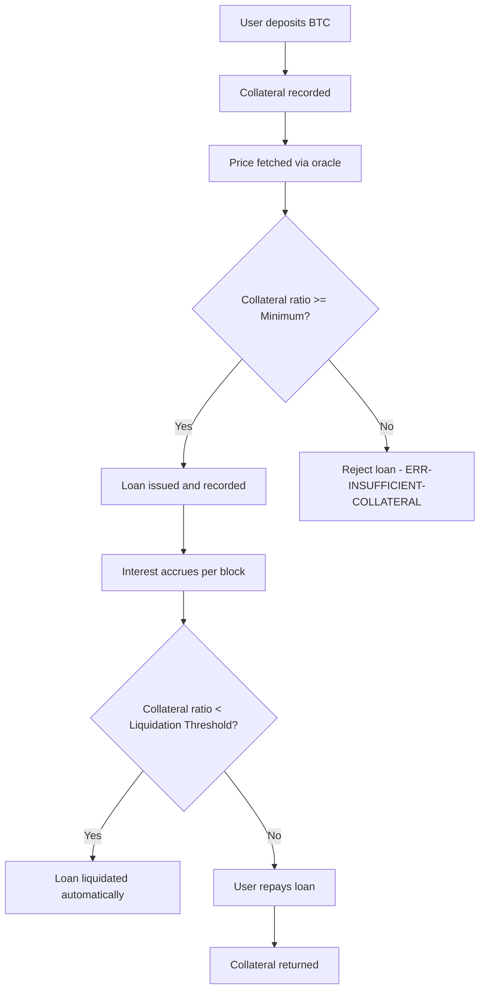

# 🏦 VaultFi - Decentralized Collateralized Lending Protocol

**VaultFi** is an advanced decentralized lending platform built on the Stacks blockchain. It enables users to leverage Bitcoin as collateral to access instant liquidity in a secure, trust-minimized, and permissionless manner.

Designed with intelligent risk management, dynamic price feed integration, and automated liquidation safeguards, VaultFi brings secure, scalable, and transparent collateral-backed lending to the decentralized finance (DeFi) ecosystem.

---

## ⚙️ System Overview

VaultFi allows users to:

* **Deposit Bitcoin** as collateral.
* **Request loans** denominated in synthetic assets or native tokens (e.g., STX).
* **Automatically manage risk** via real-time price oracles and enforced collateral ratios.
* **Trigger liquidations** when positions fall below the minimum threshold.
* **Repay loans** with accrued interest and reclaim collateral.

The protocol emphasizes security, decentralized control, and extensibility through a well-defined Clarity contract architecture.

---

## 🧱 Contract Architecture

VaultFi is implemented in Clarity and adheres to clear separation of concerns across:

### 1. **State Management**

* **Global state variables** track platform health and protocol parameters.
* **Data maps** handle user loans, collateral prices, and user portfolios.

### 2. **Core Functional Contracts**

* `initialize-platform`: One-time initialization by the contract owner.
* `deposit-collateral`: Deposits BTC collateral into the platform.
* `request-loan`: Opens a new loan position with automatic validation.
* `repay-loan`: Closes a loan by repaying principal + interest.

### 3. **Risk & Liquidation Engine**

* Continuous monitoring of loans via:

  * `calculate-collateral-ratio`
  * `check-liquidation`
  * `liquidate-position`
* Ensures solvency and triggers liquidation when ratio < threshold.

### 4. **Governance & Oracle Control**

* Admin functions to update:

  * Collateral ratio (`update-collateral-ratio`)
  * Liquidation threshold (`update-liquidation-threshold`)
  * Price feeds (`update-price-feed`)

### 5. **Read-Only Views**

* `get-loan-details`, `get-user-loans`, `get-platform-stats`, and `get-valid-assets` provide full transparency for integrators and front-end applications.

---

## 🔁 Data Flow

### Loan Lifecycle



---

## 🔐 Security Design

VaultFi incorporates the following best practices:

* **Authorization gating** on all admin functions via `CONTRACT-OWNER`.
* **Automated liquidation** to prevent undercollateralization.
* **Safe math checks** for all arithmetic operations.
* **Fail-fast assertions** to ensure only valid inputs are processed.
* **Modular risk assessment functions** for extensibility and testing.

---

## 📊 Key Constants

| Parameter                  | Value | Description                             |
| -------------------------- | ----- | --------------------------------------- |
| `minimum-collateral-ratio` | 150%  | Required collateralization for loans    |
| `liquidation-threshold`    | 120%  | Ratio at which liquidation is triggered |
| `platform-fee-rate`        | 1%    | Optional platform fee (future use)      |

---

## 🗃️ Contract Data Structures

### Loan Schema

```clojure
{
  borrower: principal,
  collateral-amount: uint,
  loan-amount: uint,
  interest-rate: uint,
  start-height: uint,
  last-interest-calc: uint,
  status: (string-ascii 20)
}
```

### User Loans

```clojure
{ active-loans: (list 10 uint) }
```

### Collateral Prices

```clojure
{ price: uint }
```

---

## 📡 Oracle Integration

VaultFi uses an **admin-controlled oracle update function**:

```clojure
(update-price-feed "BTC" 26500)
```

The oracle must be frequently updated to ensure accurate valuation of collateral and maintain the protocol's solvency.

---

## 🚀 Future Roadmap

* ✅ STX collateral support (via `VALID-ASSETS`)
* 🔄 Multi-asset loan support
* ⛓ Decentralized oracle network integration
* 📉 Dynamic interest rate models
* 🧮 Front-end loan dashboard integration

---

## 🧪 Testing & Simulation

> Ensure all critical paths (loan issuance, repayment, liquidation) are covered with test cases simulating different BTC price scenarios and block heights.

---

## 📄 License

MIT License © 2025 VaultFi Contributors

---

## 👷 Developer Notes

* Built on **Clarity** for verifiable execution.
* Designed for integration with **Bitcoin DeFi** via Stacks.
* Optimized for **scalability**, **risk mitigation**, and **composability**.

For questions or integration support, please contact the VaultFi DevOps team.
